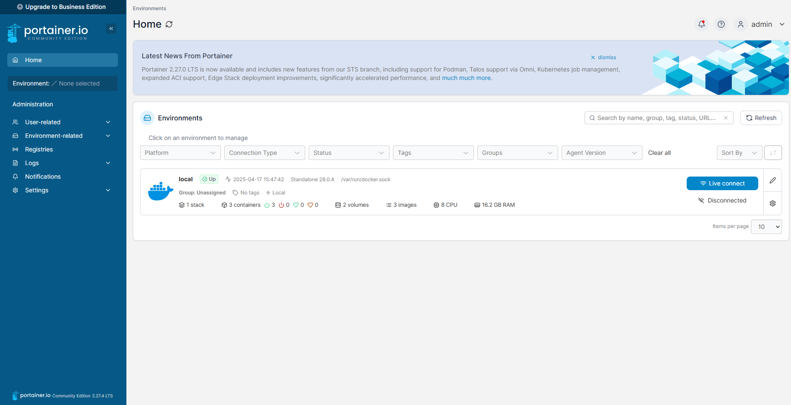

# Сервис бронирования столиков

## Общая информация

Сервис разработан на основе фреймворка **FastAPI, СУБД PostgreSQL, миграции Alembic**

Основой взаимодействия с БД является паттерн ***UnitOfWork***, что позволяет абстрактно и гибко взаимодействовать с БД.

## Структура проекта

```
.
├── environments          # Переменные окружения сервисов/
│   └── hightalent_reservation/
│       └── .env.production
├── hightalent_reservation/
│   ├── app/
│   │   ├── api               # Папка хранения API всех роутеров и Зависимостей/
│   │   │   ├── routers.py
│   │   │   └── dependencies.py
│   │   ├── database          # Здесь лежит основной (общий) репозиторий по паттерну UnitOfWork
│   │   ├── migrations        # Миграции alembic
│   │   ├── modules           # Модули сервиса/
│   │   │   ├── reservation       # Модуль бронирования столиков/
│   │   │   │   ├── models            # Модели БД
│   │   │   │   ├── schemas           # Схемы pydantic
│   │   │   │   ├── router.py         # API-роутер модуля
│   │   │   │   ├── service.py        # Функции для взаимодействия с репозиторием по бронированию столиков
│   │   │   │   └── uow.py            # Репозиторий бронирования столиков
│   │   │   └── # По такому же принципу можно вставлять любой модуль
│   │   ├── exceptions.py    # Исключения сервиса
│   │   ├── main.py          # Корень запуска проекта, содержащий middleware и включение всех роутеров
│   │   ├── settings.py      # Файл конфигурации сервиса и сервисов-соседей
│   │   ├── unitofwork.py    # Абстрактный класс к репозиториям для взаимодействия с БД
│   │   └── utils.py      
│   ├── .gitignore
│   └── startup.sh
└── docker-compose.yaml   
```

## Требования:

* **Python 3.12**
* **Docker**
* **Docker-compose**
* **PostgreSQL**
* **Poetry**

## Запуск сервиса

Клонирование сериса:

```
git clone
```

### Запуск сервиса вручную

Переходим в папку проекта:

`cd hightalent_reservation`

Проверьте **переменные окружения** в `.env.production`!

**Убедитесь** в доступности **PostgreSQL**!

**Установка** зависимостей:

`poetry install`

**Активация** виртуального окружения:

`poetry shell`

**Миграции** БД:

`alembic upgrade head`

Далее **запускаем** сервис:

```
cd app
python main.py
```

**Сервис запущен!** Теперь можно посмотреть документацию **OpenAPI** `http://{HOST}:{PORT}/docs`

### Запуск сервиса с помощью docker-compose

`docker-compose.yaml` состоит из трех контейнеров:

1. `reservation-serivce` - сам сервис бронирования столиков
2. `postgres` - СУБД PostgreSQL
3. `portainer` - Portainer для графического взаимодействия

Запускаем сервисы:

`docker-compose up -d`

Выполняем миграции БД:

`docker-compose exec reservation-service alembic upgrade head`

1. Заходим в [portainer](http://localhost:9000 "ссылка на portainer")
2. Создаем пользователя
3. Авторизируемся
4. Наблюдаем наши сервисы
5. **Готово!**

   
